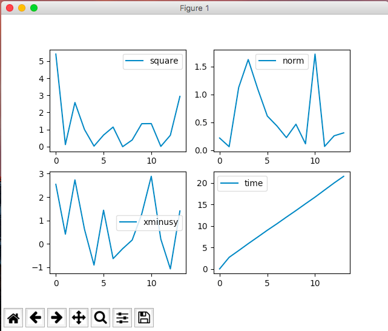
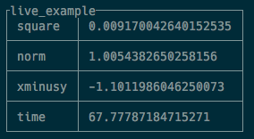

# Randopt Plugins
A bunch of plugins for randopt

To install all:

~~~shell
pip install -r requirements.txt
pip install .
~~~

## Live Wrapper

The live wrapper allows to print / plot experimental metrics live.

### Install

~~~shell
pip install matploblib terminaltables
~~~

### Usage

~~~python
import randopt as ro
from randopt_plugins.live import Live

exp = ro.Experiment('live_example', params={
    'x': ro.Gaussian(),
    'y': ro.Gaussian()
})
live = Live(exp, metrics=['square', 'norm', 'xminusy', 'time'])

start = time()
for i in range(100):
    live.sample_all_params()
    live.update('square', live.x**2)
    live.update({
        'norm': abs(exp.y),
        'xminusy': exp.x - exp.y,
        'time': time() - start
    })
    print(live.table_metrics())
    live.plot_metrics()
    sleep(1)

live.add_result(exp.x - exp.y)
live.add_result(exp.x - exp.y, {'useless': [0, 0, 0, 0]})
live.add_result(exp.x - exp.y, data={'useless': [0, 0, 0, 0]})
~~~

### Screenshots

**Live Plotting**

**Live Table**

